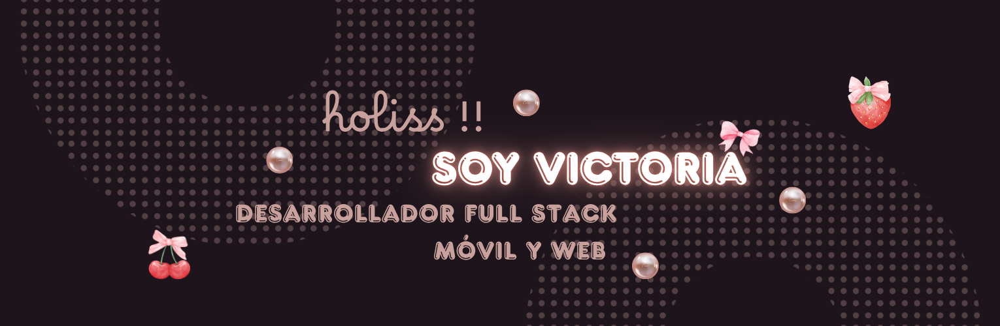

<h1 align="center">🌸 ¡Hola! Soy Vicky 💖</h1>

  

 💻 Estudiante de Ingeniería de Software | 🌷 Apasionada por el desarrollo móvil y web 💫

---

### 🌷 Sobre mí

<table>
<tr>
<td>

- 🎀 Estudio **Ingeniería de Software**  
- 🐶 Fundadora de **Dacky**, una app para rastreo GPS de mascotas  
- 💻 Manejo principalmente **Flutter, Python y C#**  
- 🌱 Actualmente aprendiendo **ASP.NET**, **Dart** y **SQL Server**  
- ✨ Me interesan los proyectos con impacto social y tecnología accesible  
- 💕 Objetivo: Convertirme en desarrolladora full-stack móvil y web  
- 📝 Fun fact: A veces diseño mejor en papel que en pantalla 😅  

</td>
<td align="right">
  
</td>
</tr>
</table>

---

### 💻💖 Tecnologías 

  
  
  
  
  
  
  
  
  
  
  
  

### 🛠🧸 Herramientas 

  
  
  
  
  
  
  
  

---

### 🚀 Proyecto DACKY

#### 🐾 Dacky

**App de rastreo GPS para mascotas** con:
- 📱 Tarjeta de vacunación virtual  
- 🐶 Perfil de mascota  
- 🔙 Backend en Flask + MySQL  
- 🎨 Frontend en Flutter  

📦 [Ver repositorio](https://github.com/smiling011/ProyectoDacky.git)

---

### 📊 Stats

  
  

---

<picture>
  <source media="(prefers-color-scheme: dark)" srcset="https://raw.githubusercontent.com/smiling011/smiling011/output/github-contribution-grid-snake-dark.svg"/>
  <source media="(prefers-color-scheme: light)" srcset="https://raw.githubusercontent.com/smiling011/smiling011/output/github-contribution-grid-snake.svg"/>
  
</picture>

---

### 🌸 Conectemos

  

 

---

